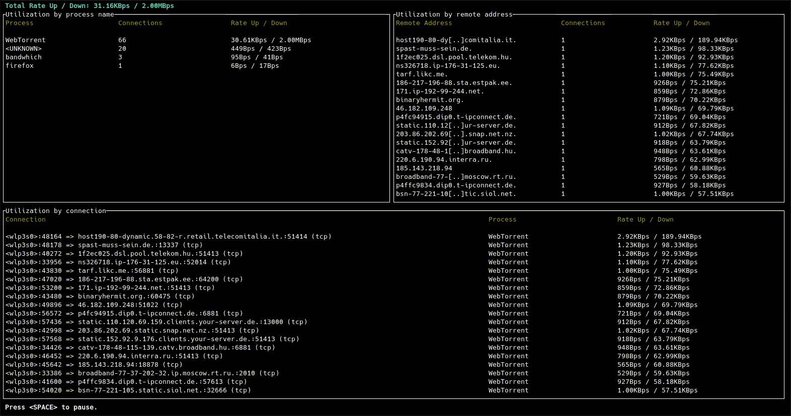

# bandwhich



This is a CLI utility for displaying current network utilization by process, connection and remote IP/hostname

## Table of contents

- [bandwhich](#bandwhich)
  - [Table of contents](#table-of-contents)
  - [Project status](#project-status)
  - [How does it work?](#how-does-it-work)
  - [Installation](#installation)
    - [Downstream packaging status](#downstream-packaging-status)
    - [Download a prebuilt binary](#download-a-prebuilt-binary)
    - [Arch Linux](#arch-linux)
    - [Nix/NixOS](#nixnixos)
    - [Void Linux](#void-linux)
    - [Fedora](#fedora)
    - [macOS/Linux (using Homebrew)](#macoslinux-using-homebrew)
    - [macOS (using MacPorts)](#macos-using-macports)
    - [FreeBSD](#freebsd)
    - [Building from source using `cargo`](#building-from-source-using-cargo)
    - [OpenWRT](#openwrt)
  - [Post install (Linux)](#post-install-linux)
    - [1. `setcap`](#1-setcap)
      - [Capabilities explained](#capabilities-explained)
    - [2. `sudo` (or alternative)](#2-sudo-or-alternative)
  - [Post install (Windows)](#post-install-windows)
  - [Usage](#usage)
  - [raw\_mode](#raw_mode)
  - [Contributing](#contributing)
  - [License](#license)

## Project status

This project is in passive maintenance. Critical issues will be addressed, but
no new features are being worked on. However, this is due to a lack of funding
and/or manpower more than anything else, so pull requests are more than welcome.

For more details, see [The Future of Bandwhich #275](https://github.com/imsnif/bandwhich/issues/275).

## How does it work?

`bandwhich` sniffs a given network interface and records IP packet size, cross referencing it with the `/proc` filesystem on linux, `lsof` on macOS, or using WinApi on windows. It is responsive to the terminal window size, displaying less info if there is no room for it. It will also attempt to resolve ips to their host name in the background using reverse DNS on a best effort basis.

## Installation

### Downstream packaging status

<a href="https://repology.org/project/bandwhich/versions">
  
</a>

### Download a prebuilt binary

If you're on linux, you can download the generic binary from the releases.

### Arch Linux

```
pacman -S bandwhich
```

### Nix/NixOS

`bandwhich` is available in [`nixpkgs`](https://github.com/nixos/nixpkgs/blob/master/pkgs/tools/networking/bandwhich/default.nix), and can be installed, for example, with `nix-env`:

```
nix-env -iA nixpkgs.bandwhich
```

### Void Linux

```
xbps-install -S bandwhich
```

### Fedora

`bandwhich` is available in [COPR](https://copr.fedorainfracloud.org/coprs/atim/bandwhich/), and can be installed via DNF:

```
sudo dnf copr enable atim/bandwhich -y && sudo dnf install bandwhich
```

### macOS/Linux (using Homebrew)

```
brew install bandwhich
```

### macOS (using MacPorts)

```
sudo port selfupdate
sudo port install bandwhich
```

### FreeBSD

```
pkg install bandwhich
```

or

```
cd /usr/ports/net-mgmt/bandwhich && make install clean
```

### Building from source using `cargo`

`bandwhich` can be installed using the Rust package manager, `cargo`.
It might be in your distro repositories if you're on linux, or you can install it via [rustup](https://rustup.rs/).
You can find additional installation instructions [here](https://doc.rust-lang.org/book/ch01-01-installation.html).

The minimum supported Rust version is **1.70.0**.

```
cargo install bandwhich
```

### OpenWRT

To install `bandwhich` on OpenWRT, you'll need to compile a binary that would fit its processor architecture. This might mean you would have to cross compile if, for example, you're working on an `x86_64` and the OpenWRT is installed on an `arm7`.
Here is an example of cross compiling in this situation:

- Check the processor architecture of your router by using `uname -m`
- Clone the bandwhich repository `git clone https://github.com/imsnif/bandwhich`
- Install `cross` using `cargo install cross`
- build the `bandwhich` package using `cross build --target armv7-unknown-linux-musleabihf`
- Copy the binary files from `target/armv7-unknown-linux-musleabihf/debug/bandwhich` to the router using `scp` by running `scp bandwhich root@192.168.1.1:~/` (here, 192.168.1.1 would be the IP address of your router).
- Finally enter the router using ssh and run the binary directly with `./bandwhich`

## Post install (Linux)

Since `bandwhich` sniffs network packets, it requires elevated privileges.
On Linux, there are two main ways to accomplish this:

### 1. `setcap`

- Permanently allow the `bandwhich` binary its required privileges (called "capabilities" in Linux).
- Do this if you want to give all unprivileged users full access to bandwhich's monitoring capabilities.
    - This is the **recommended** setup **for single user machines**, or **if all users are trusted**.
    - This is **not recommended** if you want to **ensure users cannot see others' traffic**.

```bash
# assign capabilities
sudo setcap cap_sys_ptrace,cap_dac_read_search,cap_net_raw,cap_net_admin+ep $(command -v bandwhich)
# run as unprivileged user
bandwhich
```

#### Capabilities explained
- `cap_sys_ptrace,cap_dac_read_search`: allow access to `/proc/<pid>/fd/`, so that `bandwhich` can determine which open port belongs to which process.
- `cap_net_raw,cap_net_admin`: allow capturing packets on your system.

### 2. `sudo` (or alternative)

- Require privilege escalation every time.
- Do this if you are an administrator of a multi-user environment.

```bash
sudo bandwhich
```

Note that if your installation method installed `bandwhich` to somewhere in
your home directory (you can check with `command -v bandwhich`), you may get a
`command not found` error. This is because in many distributions, `sudo` by
default does not keep your user's `$PATH` for safety concerns.

To overcome this, you can do any one of the following:
1. [make `sudo` preserve your `$PATH` environment variable](https://unix.stackexchange.com/q/83191/375550);
2. explicitly set `$PATH` while running `bandwhich`: `sudo env "PATH=$PATH" bandwhich`;
3. pass the full path to `sudo`: `sudo $(command -v bandwhich)`.

## Post install (Windows)

You might need to first install [npcap](https://npcap.com/#download) for capturing packets on Windows.

## Usage

```
USAGE:
    bandwhich [FLAGS] [OPTIONS]

FLAGS:
    -a, --addresses            Show remote addresses table only
    -c, --connections          Show connections table only
    -h, --help                 Prints help information
    -n, --no-resolve           Do not attempt to resolve IPs to their hostnames
    -p, --processes            Show processes table only
    -r, --raw                  Machine friendlier output
    -s, --show-dns             Show DNS queries
    -t, --total-utilization    Show total (cumulative) usages
    -V, --version              Prints version information

OPTIONS:
    -i, --interface <interface>    The network interface to listen on, eg. eth0
    -d, --dns-server <dns-server>    A dns server ip to use instead of the system default
```

## raw_mode

`bandwhich` also supports an easier-to-parse mode that can be piped or redirected to a file. For example, try:

```
bandwhich --raw | grep firefox
```

## Contributing

Contributions of any kind are very welcome. If you'd like a new feature (or found a bug), please open an issue or a PR.

To set up your development environment:
1. Clone the project
2. `cargo run`, or if you prefer `cargo run -- -i <network interface name>` (you can often find out the name with `ifconfig` or `iwconfig`). You might need root privileges to run this application, so be sure to use (for example) sudo.

To run tests: `cargo test`

Note that at the moment the tests do not test the os layer (anything in the `os` folder).

If you are stuck, unsure about how to approach an issue or would like some guidance, you are welcome to contact: aram@poor.dev

## License

MIT
